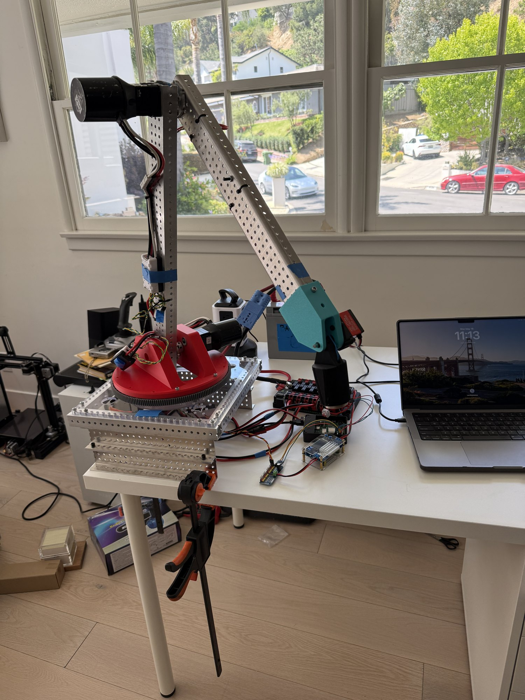
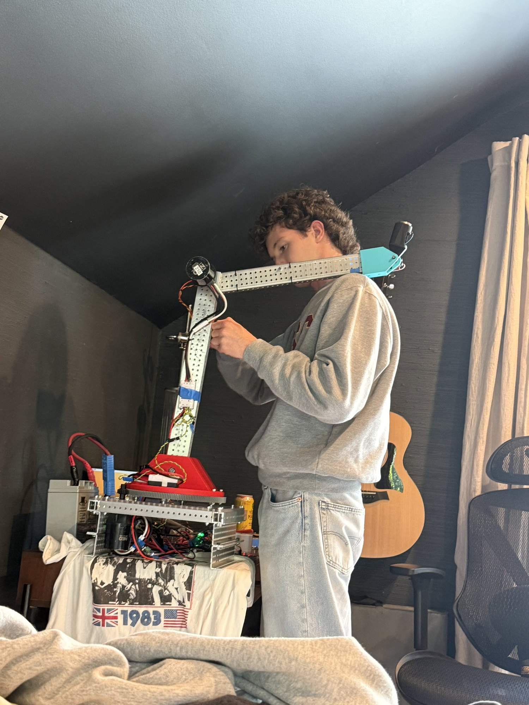
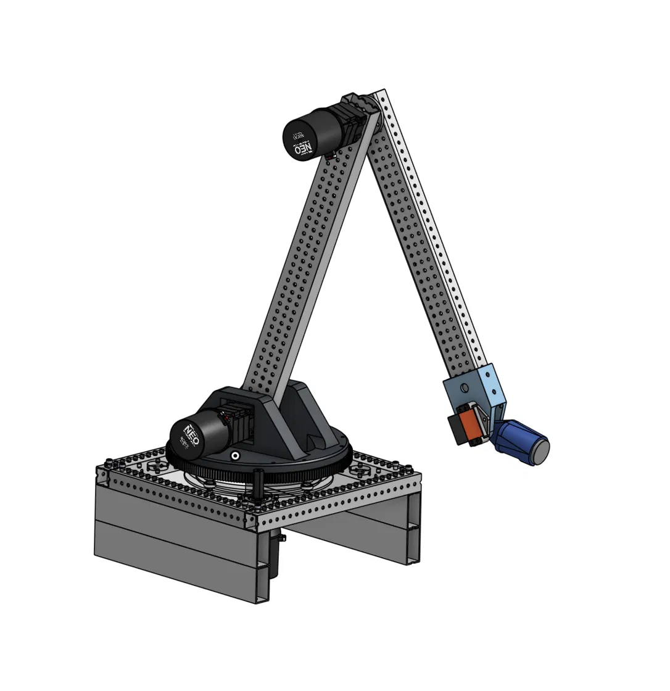
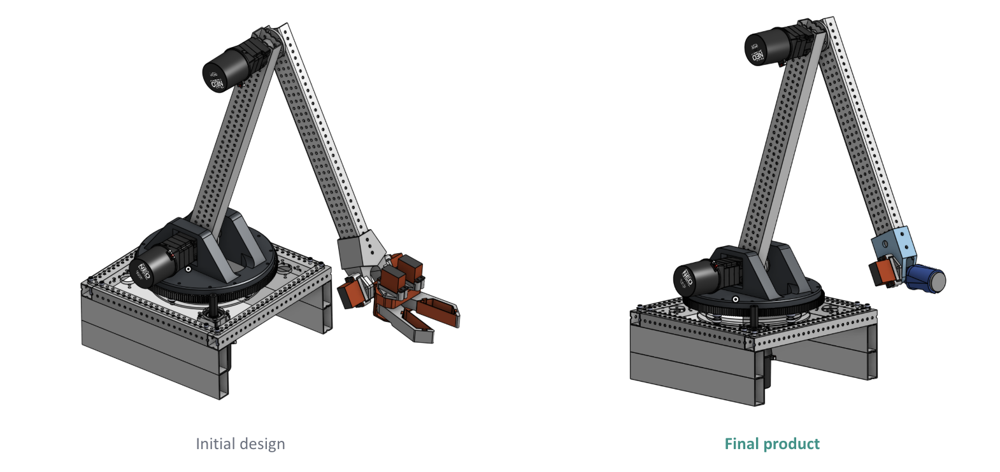
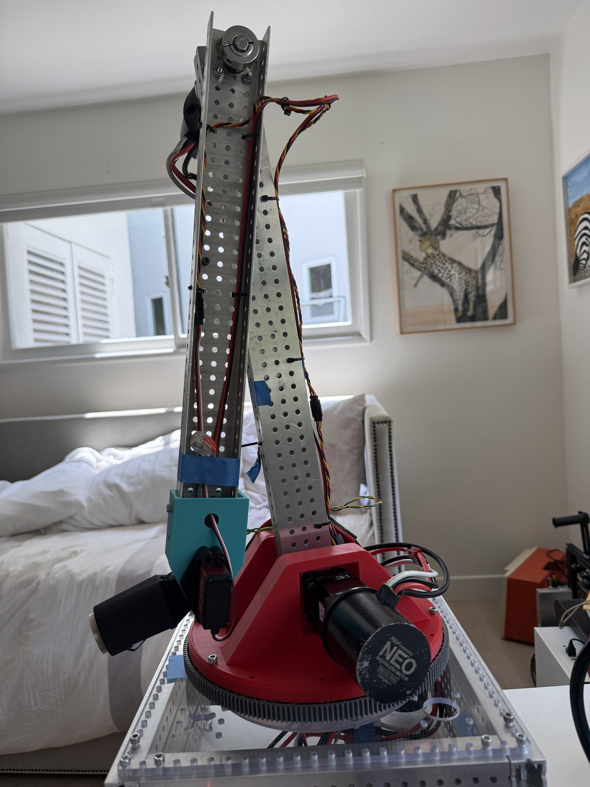
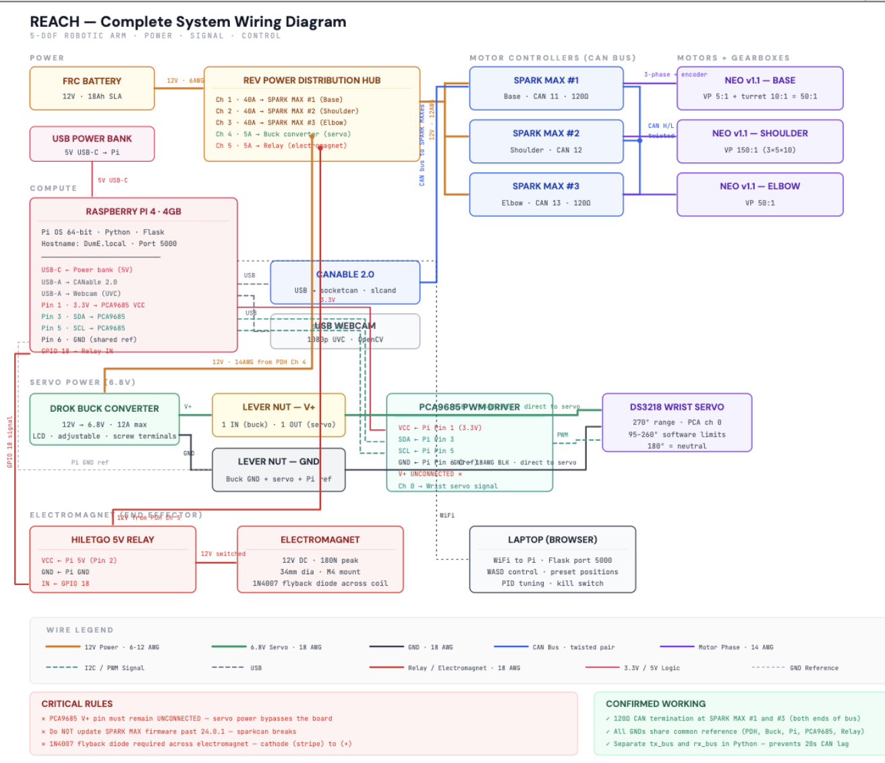
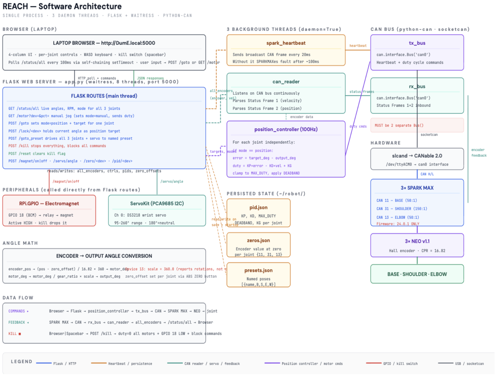
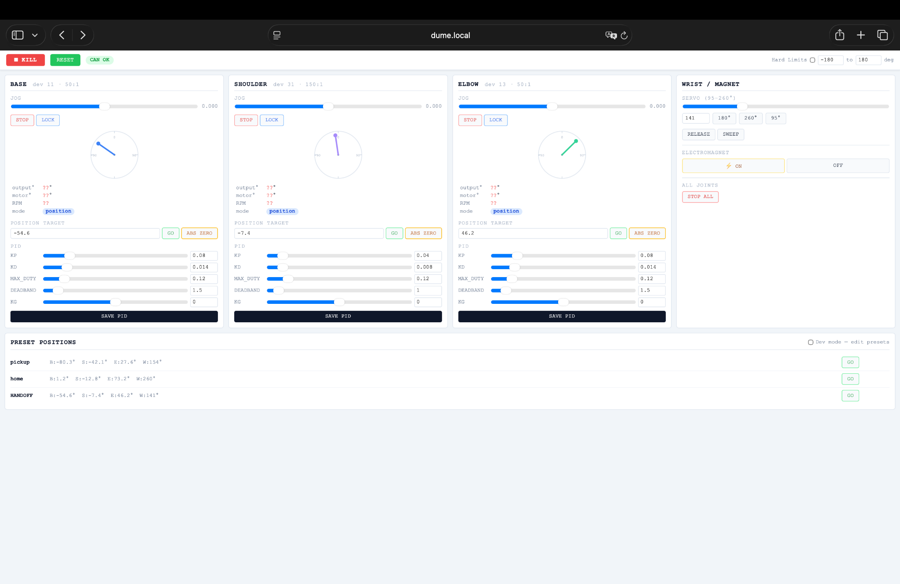

Robotic Extension for Autonomous Component Handoff



*The arm during testing, on the bench with the SLA battery, the power distribution hub, and the
laptop running the tuning interface.*

REACH is a 5-DOF robotic arm that picks up a pair of folding steel pliers and hands them to a
person. It runs on salvaged FRC hardware, meaning parts from FIRST Robotics Competition, a high
school league whose robots are built out of a standard ecosystem of brushless motors and CAN bus
motor controllers, and a Raspberry Pi talks to those controllers over CAN. Three joints run
closed-loop position control, and there is an electromagnet where a gripper would normally go.
Control happens through a browser page served by the Pi, so the Pi itself works as a control
station and so does any laptop on the same network, with no software installation required beyond
a web browser. The arm only reaches positions I physically taught it, and I drive it through the
handoff by clicking through those saved positions one at a time. The pickup and handoff ran end to
end in testing, with the pliers lifted off a flat surface and carried to a position where I could
take them off the magnet by hand.

<div style="max-width:360px;margin:2.2em 0 0.7em;">
  <iframe style="width:100%;aspect-ratio:9/16;border:0;"
    src="https://www.youtube-nocookie.com/embed/zx9uRuI9cNM"
    title="REACH tool handoff" allowfullscreen
    allow="accelerometer; clipboard-write; encrypted-media; gyroscope; picture-in-picture"></iframe>
</div>

*[REPLACE THIS CAPTION: describe exactly what the clip shows. If it is one continuous take of the
full sequence, say so. If it starts mid-motion or cuts between positions, say that instead.]*

| Spec | |
|---|---|
| Degrees of freedom | 5: base, shoulder, elbow, wrist, magnet |
| Total reach | 41 in |
| Motors | 3x NEO v1.1 brushless |
| Gearing | VersaPlanetary: 50:1 base, 150:1 shoulder, 50:1 elbow |
| End effector | 180 N peak electromagnet |
| Lateral accuracy | ±1 in at the end effector |

## Goals and constraints

I started with three goals. Closed-loop position control on every joint instead of open-loop
jogging, which shipped. Tool handoff, meaning pick up a tool and hand it to someone, which shipped.
And autonomy through computer vision and inverse kinematics, which I dropped about a month in.
Vision and IK were always stretch goals, and a month into the build it was clear that getting the
arm's own software working was going to take the entire schedule, so I cut them instead of
half-building both. The acronym is left over from the original plan. The project also carried a
codename before it had a real one, DumE, after the workshop arm in Iron Man that hands Tony Stark
his tools, which is roughly what I wanted this thing to do and is why the Pi's hostname shows up as
DumE.local in the screenshots below.

Three things constrained this project the whole way through. Everything was salvaged: the NEOs,
the VersaPlanetary gearboxes, the SPARK MAX controllers, and the battery all came off a
two-year-old competition robot, and a lot of the mechanical and electrical design is downstream of
what was already on the shelf. The hardware was free, and roughly two weeks went into electrical
problems that came with the parts rather than with my design. Print volume was the second
constraint, since every structural part had to fit into the bed of my school's printer, a Bambu
X1C, which decided part orientation before any load analysis did. The third was that the software
had to stay small enough for me to debug alone, which is why it is one Python process with Flask
and nothing else, and no ROS. I specified the architecture, chose the control approach, and did the
mechanical sizing, the encoder calibration, and the PID and gravity compensation tuning. The
control loop implementation was written with Claude Code against that specification, and the
debugging was mine.



*Most of the build happened like this.*

## Design decisions



*The final design in CAD. The arm was disassembled after the capstone presentation, so the model is
the only complete record of the assembled machine.*

The original end effector was a two-finger servo-driven gripper, and I iterated two versions of it.
With about two weeks left before the presentation I asked what I could cut to get a better demo,
and the answer was the gripper. Swapping it for a single electromagnet dropped three servos along
with their power draw and mounting. Two of them were the gripper's fingers, and the third was in
the wrist, which needed a pair to hold the gripper's mass according to the torque figures on the
servo spec sheet, where the lighter magnet needs only one. It also removed grip-force tuning
entirely. The reason I
did it was that a magnet tolerates positional error instead of fighting it, since the base runs a
1.5 degree deadband, and a gripper has to close on an object in a specific place while a magnet
only has to touch metal. The cost is that the arm only picks up ferrous objects, and the tool it
hands over is a pair of steel pliers.



*The original two-finger servo gripper on the left and the electromagnet that replaced it on the
right, swapped in about two weeks before the presentation.*

The pliers themselves are part of the design. Mechanical slop and deadband mean I can only put the
end effector within about an inch of where I want it laterally, and that error has to go somewhere,
so it went into the tool. Folding pliers collapse to a flat face roughly 1.65 by 3.6 inches, which
is large enough that an inch of positioning error still lands the magnet on metal, and flat enough
for the magnet to hold at all, which it will not do on a curved or knurled surface.

I considered dropping from CAN to PWM twice, both times during heavy debugging, because it would
have deleted an entire category of problem. I rejected it both times. PWM is an open-loop duty
cycle with no encoder feedback, so there is no position hold, no gravity compensation, and no path
to IK, and every joint would have sagged the moment I stopped commanding it. This was the closest
the project came to collapsing in scope, and keeping the harder system was right. For the same
reason I used plain Python instead of ROS. ROS would have given me a message bus and existing
kinematics libraries, but it also would have meant debugging a framework at the same time as
debugging salvaged hardware, alone, on a Pi 4.

On the mechanical side, the shoulder carries the moment of the entire arm at extension, so it gets
a 150:1 VersaPlanetary stack built as 3x5x10, while the base and the elbow both run 50:1. The base
reaches that ratio differently from the others, with a 5:1 VersaPlanetary driving a 10:1 turret
reduction rather than a single planetary stack, which matters later for what its encoder can and
cannot see. I went with equal 18-inch arm segments instead of the original 20 and 26, since equal
segments give cleaner kinematics and lower peak shoulder torque, and with more iteration I could
have determined the optimal arm sizing for my use case, but this was a demonstration. The elbow
motor mounts directly on the joint rather than a foot back on an HTD5M belt as originally designed,
accepting slightly worse shoulder torque in exchange for deleting the belt and its tensioner.



*The base assembly. The NEO drives a planetary stage into the large ring gear, which is the second
half of the base's 50:1 reduction.*

Control runs through a browser instead of a physical controller. Flask serves the UI off the Pi, so
any laptop on the network becomes a control station, with no app to install and no custom hardware
to build, and I could tune PID values live from whatever machine I was sitting at. It also had a
failure mode I did not plan for, since the school network's security meant I could not reach the Pi
from another machine, so operation moved to a separate local interface running on the Pi's own
display.

Servo power bypasses the PCA9685. The breakout drives the wrist servo's signal, but power comes
straight from a buck converter with the board's V+ rail left unconnected. The board's actual
current capacity was never specified anywhere I could find, and the figures people cite trace back
to forum posts rather than a datasheet, so I did not want the servo's current going through it. An
early version of my wiring also routed servo ground back through the PCA9685, which puts the full
return current through the board even with V+ bypassed. Servo ground now goes directly to the
buck's ground terminal, and the PCA9685's ground is tied in only as a signal reference.

The electromagnet is rated for under seven minutes of continuous use before overheating. I ran it a
few minutes once and it got warm, which made me think about what it was bolted to, and the fixture
holding it is printed PLA, which softens at a temperature the magnet itself would not care about,
so the plastic is what sets the limit. The software tracks magnet on-time and releases
automatically at three minutes.

The controller is PD with no integral term, computing duty as KP times error, minus KD times
velocity, plus KG. I left I at zero throughout, because steady-state error on these joints comes
from mechanical backlash rather than an unmodeled constant load, and an integrator cannot remove
backlash. Gravity gets handled by the feedforward term instead.

## Architecture



*Complete system wiring. This is a design artifact from partway through the build rather than a
record of the machine that shipped. The USB webcam shown was for the computer vision that got cut
and was never part of the final system, and the shoulder controller is labeled CAN 12 here but ran
as CAN 31.*

Power runs in three domains. A 12V 18Ah SLA battery feeds an FRC Power Distribution Hub, which
sends 40A channels to the three SPARK MAX controllers and 5A channels to the buck converter and the
electromagnet relay. The buck drops 12V to 6.8V for the wrist servo. The Pi runs off a separate USB
power bank, and all grounds tie to a common reference.



*Software architecture. This diagram shows the laptop browser path only. The separate operator
interface on the Pi's own display was built later, after the school network blocked remote access,
and does not appear here.*

The software is one Python process with three background threads. One broadcasts a CAN heartbeat
frame every 20ms, without which the SPARK MAX controllers fault out after roughly 100ms and stop
responding, and another listens continuously and parses velocity and position status frames. The
third is the position controller, which runs at 100Hz and computes duty for each joint
independently from the most recent encoder data. Flask serves the UI on the main thread, and
transmit and receive use separate bus objects rather than one shared object, because sharing a
single python-can Bus between the heartbeat thread and the reader thread caused enough lock
contention to put roughly twenty seconds of lag between a command and the motor moving. Commands
travel from the browser to Flask, into the position controller, out over the transmit bus to CAN,
to the SPARK MAX, to the motor. Feedback comes back the other way, from the SPARK MAX over CAN to
the receive bus, into the reader thread, and out through a status endpoint to the browser.

Raw encoder counts become output degrees in two steps:

```
motor_deg  = (position - zero_offset) / 16.82 * 360
output_deg = motor_deg / gear_ratio * scale
```

The 16.82 constant was measured empirically over five full rotations rather than taken from a
datasheet. Scale is 1.0 on the base and shoulder and 360.0 on the elbow, for reasons covered under
Unresolved. Each joint's control law computes duty as KP times error, minus KD times measured
velocity, plus KG, clamped to a maximum duty of 12% on all three joints and with a deadband around
the target. State persists to three JSON files: per-joint gains, the encoder offset at each joint's
zero position, and named poses.



*The Flask development interface. It was captured with the motor controllers powered down, which is
why every live readout shows ??, and before the per-position KG values existed, which is why KG
reads 0 on all three joints.*

There are two interfaces, and the split turned out to be useful. The Flask UI is the development
interface, exposing live encoder values, RPM, mode, per-joint PID sliders, and manual jog, which is
what I needed while tuning. The interface on the Pi's own display is a visually separate operator
interface, where I teach a position, set KG for it, and drive the arm between saved poses. Building
the second one was not planned, and it is what kept the arm operable once the school network
blocked remote access.

## What broke

### The shoulder overran and broke its mount.

The single biggest catastrophe in this project was when the shoulder joint swung well past where it
should have stopped and broke its own mount. This happened in the early phases of developing
position control, and it came down to three problems that would each have been survivable on their
own. The first was that encoder readings coming through the SPARK MAX and the sparkCAN library were
off by a large factor. Targeting the shoulder to rotate from 0deg to 30deg, the joint began moving
and the control interface readout stated "2 degrees" while the arm rapidly swung past 90. The
second problem follows from the first: because the software believed the joint had barely moved,
the position controller kept commanding it to drive, and the soft limit never triggered either,
since it was checking against the same wrong number. Every safety feature that depended on knowing
where the arm was had been blinded by one bad conversion. The third was that when I hit the space
bar (my quickly accessible emergency stop), nothing happened. It turns out the "stop" function was
written before position control existed, and only zeroed duty in manual mode. The shoulder mount
split along its layer line. The layer orientation had been optimal for normal load on the arm, and
a runaway joint was a fringe case I had not planned for. I repaired it with CA glue to keep
testing, printed a beefed-up version with fastener access paths to cut assembly time, rewrote the
emergency stop to set all motor duty to 0% regardless of mode, and empirically determined the
encoder-to-degree conversion and hard coded it into the readout.

### Position hold wouldn't hold.

While working on the actual demo, I ran into a problem where the arm would not hold position on any
joint that had gravity acting on it. The SPARK MAX motor locking mode was not strong enough to hold
the poses this application needed, so the arm would drift out of its deadzone, jerk a few degrees
back into place, and repeat that indefinitely. This affected the shoulder and elbow, which were the
only closed loop joints carrying a gravitational load, and it was made worse by the mechanical slop
in the high ratio planetary gearboxes, which meant the encoder could not see several degrees of
movement at the joint itself. With only days left before the presentation I needed something that
was guaranteed to work. I considered gravity compensation based on arm mass and joint angle,
something like KG*cos(theta), which would have been a real step toward inverse kinematics, but I
could not tune and validate it in the time I had. Instead I empirically determined the additional
duty required to hold the arm steady at each specific angle I was going to use in the demo, and
stored those values per position. This worked, and it was the last thing I built before the
presentation. It is also the reason IK would need to be rebuilt rather than added, since a table of
hold values only covers positions I already visited.

### Salvaged controllers.

Most of the two weeks I lost to electrical problems came from the hardware being free. FRC hardware
is built for mechanisms that spin a shaft with wheels on it, so a NEO has no absolute encoder, and
VersaPlanetary gearboxes stack tolerances across three stages and carry several degrees of backlash
at the ratios I was running. All of it is normally locked behind FRC competition software, so to
control the SPARK MAXes from Python I had to run them on firmware 24 for the sparkCAN library to
work, and they were on 26 when I started. The bigger problem was the controllers themselves. I
pulled spares off a two year old competition robot that had never run brushless motors, which meant
they were configured for brushed mode, and I could not switch them because my computer will not run
the old version of REV Hardware Client that is required to do it. I spent a long time trying to
work around that before eventually buying new controllers. Two other units had electrical contact
problems, most likely from FOD during competition and then sitting untouched for two years. What
made all of this slow was that I could not trust the status light lookup table to tell me which
failure I was looking at, so a configuration problem, a contact problem, and a bad motor all
presented to me the same way, which is that the motor did not spin.

### Knowing when to stop tuning.

A lesson I learned on this project was to recognize when the hardware is the limiting factor and
not my tuning ability. This came up most on the base, which swings a much larger moment arm than
any other joint. Three changes fixed it and I would call them roughly equal contributors: I dropped
KD, widened the deadband, and cut max duty to 12% of what the motor could actually do. None of
those are elegant, and together they were enough. The reason there was a floor on how well this
could be tuned is mechanical: when the motor sits behind a 5:1 planetary feeding a 10:1 turret
reduction, its encoder does not have a great idea of what is happening fifty turns later at the
joint. There is only so much you can tune out when the sensor cannot see the thing you are trying
to correct. Later, once I started tuning specifically for how the arm needed to move in the demo, I
added a transition pose that pulls the arm back into a standard configuration before the base
rotates. This keeps the rotational inertia the base sees roughly constant from one move to the
next, so a single PID profile covers every base rotation instead of needing a profile per pose.
Whatever the magnet is carrying is not heavy enough to change that meaningfully.

## What didn't ship

Computer vision got cut about a month in, and it got further than I remembered. I had a working HSV
threshold pipeline that converted to HSV, thresholded on a red-orange band, found contours,
filtered by area, and returned centroids. The first pass was too sensitive, so I built a tuner with
six sliders for adjusting the thresholds against real lighting, and then I tuned it, never wrote
the values down, and never came back to it. Nothing about it was blocked technically, and I cut it
because about a month in it was clear that getting the arm's own software working was going to take
the whole schedule, so I dropped it rather than half-build it and left it as something to pick up
over the summer if I was still interested. The webcam still appears in the wiring diagram above,
which is where the plan for it stopped.

Inverse kinematics got cut in the last two weeks. The solver was written and visualized in
matplotlib during the design phase, and it never ran on the arm. IK survived longer than vision
because it still looked necessary, and it died the moment I realized I only had to optimize for the
demo, which is the same realization that produced the electromagnet swap. The demo needs the arm to
reach three specific places, and three taught positions do that. What shipped instead is HOME,
PICKUP, and HANDOFF, captured by physically moving the arm and saving the joint angles.

That substitution only worked because of the end effector. A gripper closing on a specific object
needs accurate positioning, and with an inch of lateral error, hand-taught poses would not have
been repeatable enough to grip anything, while a flat magnet face against a flat steel face absorbs
that error completely. Slop tolerance was one of the reasons I swapped to the magnet, so that part
was not an accident, but I did not see the second-order effect at the time. Choosing an end
effector that forgives positioning error is what made it possible, two weeks later, to delete IK
entirely.

## What I'd do differently

The first thing I would build with more time is continuous gravity compensation. KG is currently a
value I tuned by hand at each taught position, which works because the arm only ever goes to
positions I taught it. Replacing it with KG times cosine of the joint angle, so that compensation
tracks arm angle instead of being looked up, is something IK requires before it can run at all,
because IK generates arbitrary poses and there is no table entry for a pose the arm has never
visited.

I would also design the kill path before the first motion command. The kill switch stops all three
controllers and drops the magnet, and it exists because a printed mount broke. It should have been
the first thing I implemented.

There are two smaller things I would go back and finish. I would budget for salvaged hardware,
since two weeks went to electrical faults that came with the parts rather than with my design, and
I planned the schedule as though free hardware was free. And I would finish what I started tuning,
since the elbow never got a tuning pass of its own and ran the whole project on the base's gains,
KP 0.08 and KD 0.014, and since the 180N magnet is dramatic overkill for an arm that hands over a
pair of pliers. Neither broke anything, but both are places where I stopped at "it works" without
going back.

The thing I would actually tell someone starting a project like this is to work backwards from the
deliverable. I spent the early months building this like a tree from the roots up, doing Pi setup,
CAN plumbing, a vision pipeline, and an IK solver, each one because it seemed like a part that a
complete robotic arm ought to have. The goal was a capstone presentation. I should have asked what
the presentation needed and built only that, and I did not do it until the last two weeks. Both of
the decisions that made this project work, the electromagnet and the KG table, came out of finally
asking that question. Working backwards gets you a demo, and it also gets you a lookup table where
a model belongs and a positioning system that only reaches three places, which were correct calls
against a deadline and are the first two things I would undo if the deadline went away.

## Unresolved

**Elbow encoder scaling.** Device 13 reports position roughly 360 times smaller than devices 11 and
31, which are identical hardware on the same bus. A scale constant corrects it in software. I never
found the root cause, and my best guess is a unit conversion where that device reports rotations and
the others report something else, but I never confirmed it.

**Shoulder brake mode will not persist.** Setting idle mode over CAN does not survive a power cycle
even though the flash write confirms. I tried through both raw python-can and the compiled sparkCAN
library. Worked around with software position hold.

**No authentication.** The Flask interface has no login, so anyone on the same network can command
the arm, write PID values, and drive the motors. That is acceptable for a bench project on a home
network and would not be acceptable anywhere shared.

---

A note on sources: the arm was disassembled after the capstone presentation and the codebase was
lost when I reflashed the Pi, so this writeup is reconstructed from CAD, the architecture diagrams,
the development interface, build photographs, and my own notes.

Built 2026. FRC Team 1452 hardware, Raspberry Pi 4, REV SPARK MAX, NEO v1.1, Python and Flask.
